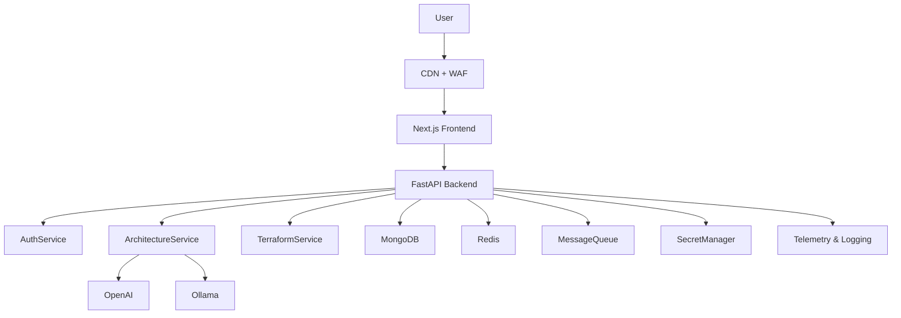

# ArchGen AI
### Production-Grade AI-Powered Cloud Architecture Studio & HCL Compiler

ArchGen AI is a secure, cloud-native SaaS studio. It allows enterprise DevOps teams to autonomously design visual cloud diagrams, persist configurations in MongoDB databases, secure authentication via JWT tokens, and compile modular, deployable HashiCorp HCL Terraform code automatically.

---

## 🚀 Running the SaaS Stack

### Option 1: Docker Compose (Single-Command Run)
To build and spin up the complete SaaS stack (Next.js multi-stage frontend, FastAPI backend, and MongoDB database cluster), execute:

```bash
docker-compose up --build
```
- **SaaS Web Portal**: [http://localhost:3000](http://localhost:3000)
- **FastAPI Core Server**: [http://localhost:8000](http://localhost:8000)
- **MongoDB Instance**: [http://localhost:27017](http://localhost:27017)

---

### Option 2: Local Manual Setup

#### 1. Setup Database
Ensure you have MongoDB running locally at `mongodb://localhost:27017` or configure custom `MONGO_URI` environment settings.

#### 2. Backend Orchestrator
Navigate to the backend directory, install Python packages, and boot the uvicorn web server:

```bash
cd backend
python -m pip install -r requirements.txt
uvicorn main:app --host 0.0.0.0 --port 8000 --reload
```
*The server binds to http://localhost:8000.*

#### 3. Frontend Portal
Navigate to the frontend directory, install npm modules, compile Next.js, and launch:

```bash
cd frontend
npm install
npm run dev
```
*The client binds to http://localhost:3000.*

---

## ⚙️ Environment Variables Config

### Backend Configuration (`backend/.env`)
Create a `.env` file under `backend/` using this template:

```env
OPENAI_API_KEY=your_openai_key_here
MODEL_NAME=gpt-4o-mini
AI_PROVIDER=openai
OLLAMA_BASE_URL=http://localhost:11434
OLLAMA_MODEL=deepseek-r1:8b
MONGO_URI=mongodb://localhost:27017
DATABASE_NAME=archgen_db
JWT_SECRET_KEY=archgen_super_secure_secret_hash_key_12345!
PORT=8000
HOST=0.0.0.0
```
> [!NOTE]
> The provider chain now resolves as OpenAI → Ollama → Mock. If OpenAI is unavailable, the backend will automatically try Ollama before falling back to mock mode.

### Frontend Configuration (`frontend/.env`)
Create a `.env` file under `frontend/` using this template:

```env
NEXT_PUBLIC_API_URL=http://localhost:8000
```

---

## 🏛️ Application Routing Architecture

* **`/` (Landing Page)**: Premium monochrome animated introduction showing timelines and CTA studio routes.
* **`/login` (User Authorization)**: Checks credentials and issues JWT Bearer header keys.
* **`/register` (User Registration)**: Hashes passwords with bcrypt and inserts users into MongoDB.
* **`/dashboard` (Protected Studio Workspace)**: Gated route redirecting to login if no token exists. Houses the configuration form, visual diagram editor, and locked tabs panels.

---

## 🛠️ Comprehensive Troubleshooting Manual

### 1. MongoDB Connection Timeouts
* **Symptoms**: Backend startup outputs `Failed to connect to MongoDB: server selection timeout`.
* **Solution**: Ensure your MongoDB instance is running. If running under Docker Compose, the connection URI is dynamically mapped to `mongodb://mongodb:27017`. For local runs, ensure the database port `27017` is bound.

### 2. Authorization (JWT) Expiration & CORS Blockage
* **Symptoms**: Visual canvas throws `401 Unauthorized` errors when listing saved repositories.
* **Solution**: Auth tokens expire in 24 hours. Clear local storage and log back in to renew token scopes.

### 3. Next.js Prerendering Failures
* **Symptoms**: Production build `npm run build` fails at `/page` or `/dashboard`.
* **Solution**: Ensure all Lucide icons are imported correctly. Client-side variables (like `localStorage`) must be read inside `useEffect` blocks to prevent Server-Side Rendering (SSR) discrepancies. Our multi-stage Docker build handles these conditions safely.


---

## 🏗️ ArchGen AI: Application Architecture

This section describes the application architecture of the ArchGen AI platform.

### 1. Architecture Overview
ArchGen AI is a scalable, cloud-native SaaS application. It leverages a modern decoupled microservices architecture to provide a highly available and secure environment for generating cloud architectures and compiling Terraform configurations.

### 2. Full Application Architecture

**Users**  
&nbsp;&nbsp;↓  
**Global CDN + WAF (Web Application Firewall)**  
&nbsp;&nbsp;↓  
**Static Web App** *(Next.js Frontend)*  
&nbsp;&nbsp;↓  
**Containerized Microservices** *(FastAPI Backend)*  
&nbsp;&nbsp;↓  
**NoSQL Database** *(MongoDB Atlas / Stateful Storage)*  

### 3. Component Responsibilities
* **Global CDN + WAF**: Global entry point, load balancing, edge caching, and Web Application Firewall for DDoS and malicious payload protection.
* **Static Web App**: Hosts the static Next.js frontend, ensuring global edge caching and fast delivery of the React Flow UI.
* **Containerized Microservices**: Hosts the FastAPI backend orchestrating business logic (Auth, Architecture Generation, Terraform Generation).
* **NoSQL Database**: Persistent database (MongoDB) storing user profiles, saved projects, and historical architectures.
* **Message Queue**: Asynchronous message broker (e.g. Service Bus / RabbitMQ) for heavy document processing and background worker tasks.
* **Secret Manager**: Centralized and isolated secret management (e.g. Vault / Key Management Service) for AI provider keys, database credentials, and JWT secrets.
* **In-Memory Cache**: Ephemeral session caching and fast retrieval for repetitive queries (e.g. Redis).
* **Object Storage**: General-purpose blob storage for exportable files (Terraform zip archives) and static assets (e.g. S3 / Blob Storage).
* **Telemetry & Monitoring**: Distributed tracing, log aggregation, and centralized application monitoring.

### 4. Request Flow
**User** → **Frontend** → **FastAPI Backend** → **ArchitectureReasoningAgent** → **InfrastructureReasoningEngine** → **Architecture Graph** → **Terraform Generator** → **MongoDB Save** → **Frontend Display**

### 5. AI Provider Flow
The AI orchestration pipeline implements a resilient fallback mechanism:
1. **OpenAI** (Primary)
   &nbsp;&nbsp;↓ *If Failure*
2. **Ollama** (Secondary Local/Hosted)
   &nbsp;&nbsp;↓ *If Failure*
3. **Mock Provider** (Deterministic Fallback)

*All provider telemetry and active models are logged and returned directly to the UI.*

### 6. Terraform Generation Flow
The backend synthesizes the visual Architecture Graph into modular HashiCorp Configuration Language (HCL). It utilizes centralized naming enforcement, template mapping for multi-cloud deployments (AWS, Azure, GCP), and ensures output consistency before compressing and returning the templates.

### 7. Deployment Architecture
* **Frontend**: Global Edge Static Hosting
* **Backend**: Container Orchestrator (Autoscaling from 0 to N based on concurrent HTTP requests)
* **Database**: Managed MongoDB (Multi-region replica set)
* **Cache**: Managed Redis
* **Monitoring**: Centralized Log Aggregation

### 8. Security Architecture
* **WAF**: Protects against OWASP Top 10 vulnerabilities.
* **Secret Manager**: Secrets are isolated; components authenticate using internal IAM roles.
* **JWT Authentication**: Stateless, expiring token authorization.
* **Role Based Access Control (RBAC)**: Enforced at the control plane.
* **HTTPS Everywhere**: End-to-end TLS encryption.
* **Audit Logging**: Comprehensive logging via centralized monitoring.

### 9. Scalability Strategy
* **Frontend**: Automatically scaled and cached globally via CDN.
* **Backend**: Container instances dynamically scale based on demand.
* **Database**: MongoDB allows transparent horizontal sharding and vertical scaling.
* **Cache & Monitoring**: Fully managed PaaS services designed to elastically absorb varying workloads.

### 10. Architecture Diagram



### 11. Future Multi-Cloud Expansion
The infrastructure modules are entirely decoupled from the business logic. Future iterations will allow ArchGen AI to be easily deployed on AWS, Azure, or GCP with minimal friction.
